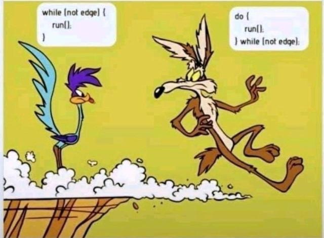

# 18. Desktopové programování v jazyku Java (SE)
Zadání: Syntaxe, konstrukce funkce, práce se standardním vstupem a výstupem, proměnné a datové typy, řídicí struktury.
Třídy, dědičnost, zapouzdření. Výjimky a zpracování. Jazyk UML, use case, diagram tříd, testování FuT, InT, UAT.

---

## Syntaxe

### Řádky

Každý řádek kódu Javy se musí nacházet v nějaké třídě - standardně se třídy pojmenovávají na začátku s velkým písmenem a slova se **NE**ROZDĚLUJÍ mezerou, ale kapitalizací prvního písmena dalšího slova (Java je case sensitive).

Např.: `class HelloWorld`

Konec každého řádku musí mít středník `;`

---

### Přístup k vlastnostem objektu

K vlastnostem, polím a metodám objeku se přistupuje přes tečkovou notaci.

Např.: Objekt třídy 'Auto' má vlastnost 'znacka'.
K této vlastnosti se dostaneme takto:
```java
Auto mojeAuto = new Auto("BMW"); 
mojeAuto.znacka // Přístup k vlastnosti 'znacka'
```

---

### Modifikátory přístupnosti

Metody, vlastnosti, pole a třídy (dále jen MVPT) jsou označeny modifikátorem přístupnosti, který určuje kdo tyto MVPT může vidět a přistupovat k nim.

*Žádný modifikátor* - MVPT jsou viditelné pro celý package (složka).

`private` - MVPT jsou viditelné jen pro třídu, kde se nacházají.

`public` - MVPT jsou viditelné všude.

`protected` - MVPT jsou viditelné pro všechny podtřídy a třídu, kde se nacházejí.

Např.:
```java
public int cislo = 5;
private class NejakaData {}
protected float desCislo = 5.4f;
```

---

## Konstrukce metody (funkce)

Každá metoda se musí nacházet v nějaké třídě, mít návratový datový typ, jméno a definované tělo.

Popřípadě může mít metoda ještě modifikátor přístupnosti,argumenty a jiná klíčová slova.

```java
public class Main {

    public float nasobeniCisel(float cisloA, float cisloB) {
        return cisloA * cisloB;
    }

}
```

Na příkladu je nadefinována metoda `nasobeniCisel`, přístupná odkudkoliv (mod. přístupnosti `public`), která vyžaduje 2 argumenty `cisloA` a `cisloB`. Návratový datový typ je `float` a tělo této metody je definováno mezi složenými závorkami.

V případě, že metoda nevrací žádnou hodnotu, jako návratový datový typ se udává `void` a tělo nesmí obsahovat klíčové slovo `return`.

```java
public void vypisJmeno() {
    System.out.println("Amélie");
}
```

---

## Práce se standardním vstupem a výstupem

Standardní vstup - vstup z klávesnice.
V Javě existují 2 způsoby čtení vstupu z klávesnice (protože Java je garbage).

Standardní výstup - výstup z operačního systému (obvykle na obrazovku, ale je možné přesměrovat výstup do souboru nebo na sériový port)

---

### Vstup

Čtení vstupu z klávesnice je možné dosáhnout použitím třídy `Scanner` z balíčku `java.util`

```java
import java.util.Scanner; // Importování třídy Scanner z balíčku

class Main {
    public static void main(String[] args) {
        Scanner s = new Scanner(System.in);

        System.out.println("Zadejte jméno: ");
        String jmeno = s.nextLine(); // Metoda k načtení řádku z klávesnice
    }
}
```

Třída Scanner obsahuje různé metody pro načtení různých datových typů (např. pro načtení celého čísla - `nextInt()`). V případě, že uživatel zadá nepovolené znaky, během čtení jiných datových typů, metoda vyhodí vyjímku.

---

### Výstup

Pro vypsání na výstup se používá statická třída `System`, která obsahuje pole `out`, kde je možné poslat výstup za pomocí metod `print` a `println`.

Metoda `print` neukončuje řádek. Tudíž další výstup se zapíše hned za posledním znakem z minulého výstupu.

Metoda `println` řádek ukončuje.

```java
class Main {
    public static void main(String[] args) {
        //Použití print
        System.out.print("Teplota je:");
        System.out.print("18°C");

        //Použití println
        System.out.println("Zítra bude:");
        System.out.println("18°C");
    }
}

// Výstup po spuštění:
// Teplota je:18°C
// Teplota je:
// 18°C
```

---

## Proměnné a datové typy

### Proměnné

Proměnné = pole (ne seznam)

Pole a vlastnosti se musí nacházet v nějaké třídě, mít datový typ a jméno.
Mohou mít nastavený modifikátor přístupnosti a výchozí hodnotu.

Pole uchovávají data a k přístupu k nim (a jejich modifikaci) se používají vlastnosti.
Vlastnosti jsou, technicky vzato, metody.

```java
public class Zak {
    private String jmeno; // pole
    private int vek; // taky pole
    private int znamka;

    // vlastnost (getter)
    public String getJmeno() {
        return jmeno;
    }

    // taky vlastnost (setter)
    public void setZnamka(int novaZnamka) {
        znamka = novaZnamka;
    }
}
```

---

### Datové typy

Existují primitivní datové typy a neprimitivní datové typy.

Primitivní 
- Jsou předvytvořené
- Musí mít nadefinovanou hodnotu (nemohou být `null`)
- Nobsahují metody 

Neprimitivní (V podstatě to jsou třídy)
- Vytváří je programátor
- Mohou být `null`
- Mohou obsahovat metody

Typ String je výjimka - jedná se o předvytvořený neprimitivní datový typ.

```java
public class Auto {
    private String znacka = "BMW" // neprimitivní datový typ String
    private int rokVyroby = 2013; // primitivní datový typ int
}

public class Prodejna {
    private Auto posledniProdaneAuto; // neprimitivní datový typ Auto (defaulntě bude hodnota null)
}
```

---

## Řídicí struktury

Řídicí struktury jsou bloky, které mění cestu toku programu.

### if / else if / else

Řídicí strukura `if` (podmínka) vyžaduje argument dat. typu `boolean`. Jestliže hodnota tohoto argumentu je `true`, program se vydá do bloku této podmínky.

```java
int hodnota = 5;
if (hodnota == 5) {
    System.out.println("Hodnota je 5");
}

// Výstup:
// Hodnota je 5
```

Za tuto podmínku lze umístit strukturu `else if`, která taktéž vyžaduje argument. V případě, že podmínka `if` nebyla splněna, program pokračuje do této *podpodmínky* `else if`.

```java
int hodnota = 4;
if (hodnota == 5) {
    System.out.println("Hodnota je 5");
} else if (hodnota == 4) {
    System.out.println("Hodnota je 4");
}

// Výstup:
// Hodnota je 4
```

Na konec tohoto řetězce podmínek a podpodmínek lze umístit strukturu `else`, která nepřijímá žádné argumenty. V případě, že podmínka, ani žádná z podpodmínek, nebyla splněna, se program vydá do bloku této struktury.

```java
int hodnota = 7;
if (hodnota == 5) {
    System.out.println("Hodnota je 5");
} else if (hodnota == 4) {
    System.out.println("Hodnota je 4");
} else {
    System.out.println("Hodnota není 5, ani 4");
}

// Výstup:
// Hodnota není 5, ani 4
```

---

### Cykly

Slouží k opakování bloku kódu. Existují 3 cykly - `for` (s pevným počtem opakování), `while` (s podmínkou na začátku), `do while` (s podmínkou na konci)

Cyklus `for` potřebuje nadefinovat proměnnou cyklu, podmínku cyklu a způsob inkrementace proměnné cyklu.
```java
// int i = 0 <- Nadefinování proměnné cyklu i, jejíž hodnota bude ze začátku 0

// i < 10 <- Nadefinování podmínky cyklu. Cyklus se bude opakovat
// dokud bude podmínka splněna

// i++ <- Nadefinování způsobu inkrementace proměnné cyklu. 
for (int i = 0; i < 10; i++) {
    System.out.println(i + ". Iterace cyklem...");
}
```

Cyklus `while` vyžaduje podmínku. Tato podmínka bude provedena před každým průběhem cyklu. Pokud podmínka nebude splněna, cyklus se ukončí.

```java
int hodnota = 0;
while (hodnota < 100) {
    hodnota += nahodneCisloMezi(1, 5);
}
```

Cyklus `do while` vyžaduje podmínku. Tato podmínka bude prevedena po každém průběhu cyklu. Pokud podmínka nebude splněna, cyklus se ukončí.

```java
int hodnota = 0;
do {
    hodnota += nahodneCisloMezi(1, 20);
} while (hodnota < 10);
```

Pokud někomu dělá problém najít rozdíl mezi cykly `while` a `do while`, tento obrázek by mohl pomoct ;)



---

### Break a Continue

Pro předčasné ukončení cyklu slouží řídicí struktura `break`, která okamžitě ukončí cyklus.

```java
//Nekonečný cyklus
while (true) {
    // Pokud další náhodné číslo bude 1, ukonči tuto nekonečnou smyčku
    if (nahodneCisloMezi(0, 1) == 1) {
        break;
    }
}
```

Pro přeskočení iterace cyklu slouží řídicí struktura `continue`.

```java
for (int i = 0; i < 10; i++) {
    // Přeskoč každou sudou iteraci
    if ((i+1) % 2 == 0) {
        continue;
    }
}
```

---

## Třídy, dědičnost, zapouzdření

### Třídy

Třída je *šablona* pro vytváření objektů. Třída může obsahovat pole, vlastnosti, metody a konstruktory.

*Pole, vlastnosti a metody jsou popsány výše.*
Konstruktor je *"speciální druh metody"*. Slouží k inicializaci objektu a případnému nastavení výchozích hodnot do polí. Třída může mít několik konstruktorů. Jestliže má třída konstrukor, při vytváření objektu je nutné použít jeden z nadefinovaných konstruktorů. Jestliže třída nemá nadefinovaný konstrukor, všechna pole budou mít výchozí hodnotu jejich datového typu.

```java
public class Zak {
    private String jmeno;
    private int vek;
    private boolean ukolNapsan;

    public void napsatUkol() {
        ukolNapsan = true;
    }

    // Konstruktor 1
    public Zak() {
        ukolNapsan = false;
    }

    // Konstruktor 2
    public Zak(String jmenoZaka, int vekZaka) {
        jmeno = jmenoZaka;
        vek = vekZaka;
        ukolNapsan = false;
    }
}
```

Objekt třídy se vytváří takto
```java
Zak zak1 = new Zak(); // Použije se Konstruktor 1
Zak zak2 = new Zak("David", 18); // Použije se Konstruktor 2
```

---

### Dědičnost

Třídy mohou dědit jinou třídu, čímž zdědí všechny `public` a `protected` pole, vlastnosti a metody. Tyto *podtřídy* mohou přepsat tělo zděděných vlastností a metod. K tomuto přepsání se používá anotace `@Override`.

K dědění slouží klíčové slovo `extends`, které se píše za název třídy, a je následováno názvem třídy, kterou má zdědit.

```java
class Zvire {
    protected String barva;

    public void zvukZvirete() {
        System.out.println("Zvíře dělá zvuk");
    }
}

// Třída Liska má pole 'barva' a metodu 'zvukZvirete'
class Liska extends Zvire {
    @Override
    public void zvukZvirete() {
        System.out.println("What does the fox say?");
    }
}

// Třída Pes má pole 'barva' a metodu 'zvukZvirete'
class Pes extends Animal {
    @Override
    public void zvukZvirete() {
        System.out.println("haf, řekl " + barva + " pes.");
    }
}
```

---

## Výjimky a zpracování

Program vyhodí výjimku, dojde-li k chybě. Pokud výjimka není zpracována, program spadne.

Výjimky se zpracovávají pomocí bloků `try` a `catch`. V bloku `try` se nachází kód, který by mohl způsobit pád programu. Bloky `catch` (bloků `catch` může být více, ale každý musí odchytávat jinou výjimku) obsahují kód, který se vykoná, dojde-li k dané výjimce.

```java
try {
    int cislo = s.nextInt(); // Scanner pro vstup z klávesnice
    int deleni = 10 / cislo; //Dělení nulou hází ArithmeticException
    System.out.println(deleni);
} catch (InputMismatchException e) {
    System.out.println("Chyba - Nezadali jste číslo!");
} catch (ArithmeticException e) {
    System.out.println("Chyba - Dělení nulou!");
} catch (Exception e) {
    System.out.println("Stala se neočekávaná chyba");
}
```

---

## Jazyk UML, use case, diagram tříd, testování FuT, InT, UAT.

xd

Učil to Prokop.

```
Autor: Adam Žluva
Datum: 5. 3. 2022
```