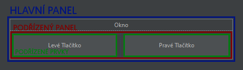

# 21. Frameworky pro desktopová řešení
Zadání: Formulářové prvky, kontejnery (kontejnery a jejich vlastnosti, pokročilé prvky formulářových aplikací, pokročilé události formulářových prvků. Vícevláknové aplikace. Grafický engine Swing. Grafický engine Unity3D. Grafické objekty a jejich ovládání (posun, kolize), pohybující se objekty, tvorba a ovládání interaktivních objektů.

---

## Formulářové prvky

Jsou to veškeré viditelné grafické prvky v okenní aplikaci. Může se jednat o tlačítko, obrázek, vstupní pole, zaškrkávací seznam, apod. Tyto prvky mají různé vlastnosti, které je možné nastavit - např.: velikost, pravidla pozicování, barva pozadí, apod. Prvky jsou umístěny do kontejnerů.

Tyto prvky mohou vyvolávat události, které je programově možné zachytit a, na základě této události, provést nějakou akci. Například, aby se po kliknutí na tlačítko otevřelo nové okno.

---

## Kontejnery

Panely, do kterých můžeme umístit jiné forulářové prvky (podřízené prvky / dceřiné prvky). Tyto panely se starají o umísťování podřízených prvků pomocí Layout Managerů.



---

## Grafický engine Swing

Základní framework pro tvorbu okenních aplikací v Javě. Každé okno je vázané na třídu a veškeré formulářové prvky jsou uloženy do polí této třídy.

```java
// Příklad třídy vázané na okno
package com.company.View;

import javax.swing.*;

public class ExampleForm extends JFrame {

    private JButton buttonL;
    private JButton buttonP;
    private JPanel mainPanel;

    public ExampleForm() {
        setSize(640, 350);
        setResizable(true);
        setTitle("Okno");
        setDefaultCloseOperation(EXIT_ON_CLOSE);
        setContentPane(getMainPanel());
        pack();
        setVisible(true);
    }

    public JButton getButtonL() {
        return buttonL;
    }

    public JButton getButtonP() {
        return buttonP;
    }

    public JPanel getMainPanel() {
        return mainPanel;
    }
}
```

---

## Vícevláknové aplikace

Pokud chceme vykonávat nějaký kód asynchronně, je třeba jej spustit v novém vlákně. Tento kód se bude provádět nezávisle na hlavním vlákně. Vícevláknové programování se hodí především v okenních aplikacích. Konkrétně ve Swingu, okenní aplikace a jejich kód běží na jednom vlákně. Pokud bychom toto vlákno zatížili výpočetně náročným úkonem, aplikace by se stala neresponzivní a nešlo by s ní interagovat do doby, dokud by úkon neskončil.

V Javě můžeme vytvořit nové vlákno dvěma způsoby:

### Implementací rozhraní Runnable

Rozhraní Runnable vyžaduje implementovat metodu `run()`, která bude provedena při spuštění vlánka s třídou, která toto rozhraní implementuje.

```java
public class Main {
    public void main(String[] args) {
        Thread t = new Thread(new AsynchronniAkce());
        t.start();
        for (int i = 0; i < 50; i++) {
            System.out.println("Teď jede hlavní vlákno!");
        }
    }

    private class AsynchronniAkce implements Runnable {
        public void run() {
            for (int i = 0; i < 10000000; i++) {
                System.out.println(i);
            }
        }
    }
}

// Výstup:
// 0
// Teď jede hlavní vlákno
// 1
// 2
// Teď jede hlavní vlákno
// Teď jede hlavní vlákno
// ...
```

### Vytvořením objketu třídy Thread s výrazem lambda

Při vytváření objektu třídy Thread můžeme jako argument konstruktoru předat váraz lambda, který obsahuje kód, který má toho vlákno vykonat.

```java
public class Main {
    public void main(String[] args) {
        Thread t = new Thread(() -> {
            for (int i = 0; i < 50; i++) {
                System.out.println(i);
            }
        });
        t.start();

        for (int i = 0; i < 50; i++) {
            System.out.println("Teď jede hlavní vlákno!");
        }
    }
}

// Výstup:
// Teď jede hlavní vlákno
// Teď jede hlavní vlákno
// 0
// 1
// Teď jede hlavní vlákno
// 2
// Teď jede hlavní vlákno
// ...
```

---

## Grafický engine Unity3D

Unity3D je modulární herní engine, což znamená že je možné jej použít pro vývoj videoher jakéhokoliv žánru. Toho je docíleno architekturou založenou na komponentech.

Disponuje fyzikálním, zvukovým, vstupním, grafickým enginem.

---

### Grafické objekty

Objekty, které se vykreslují na obrazovku. Za vykreslování zodpovidá komponent `MeshRenderer`. Data o modelu. který má vykreslit, si bere z komponentu `MeshFilter`.


Komponent `MeshRenderer` vykresluje daný model pomocí materiálu, který obsahuje shader, kterým budou pixely na obrazovce vykresleny.

---

### Ovládání objektů

Pro ovládání objektů je nutné vytvořit vlastní komponent. Komponenty se píší v jazyce C#, který je velice podobný jazyku Java ~~a je supériornější komplet ve všem nad Javou~~.

Všechny komponenty mají k dispozici několik metod, které mohou implementovat. Nejdůležitejší jsou:
- `Awake` - volá se při vytváření instance
- `Start` - volá se při aktivaci komponentu před prvním volání `Update`
- `Update` - volá se každý snímek, kdy hra běží

Pro ovládání objektu nejdříve potřebujeme načíst uživatelský vstup, který budeme načítat v metodě `Update`:
```cs
float vstup;
void Update() {
    vstup = Input.GetAxis("Horizontal");
}
```

Objekty lze ovládat dvěma způsoby:
- Modifikací pozice
- Aplikováním síly na komponent zajišťující simulaci fyziky.

#### Modifikací pozice

Každý komponent může přistupovat ke svému komponentu `Transform`, který uchovává pozici objektu, pomocí vlastnosti `transform`.
Komponent `Transform` umožňuje *posunout* objekt v zadaném směru pomocí metody `Translate`.

```cs
void Update() {
    vstup = Input.GetAxis("Horizontal") * Time.deltaTime;
    transform.Translate(vstup, 0f, 0f); // Objekt se posune o 'vstup' na ose X
}
```

#### Aplikováním síly na komponent zajišťující simulaci fyziky.

Simulaci fyziky zajišťuje komponent `Rigidbody`. K tomuto komponentu je třeba nastavit referenci ručně:

```cs
Rigidbody rigidbody;
void Start() {
    // Pokusí se získat komponent typu 'Rigidbody' z objektu
    rigidbody = GetComponent<Rigidbody>();
}

void Update() {
    vstup = Input.GetAxis("Horizontal") * Time.deltaTime;
    rigidbody.AddForce(vstup, 0f, 0f);
}
```

---

### Kolize objektů

K detekci kolizí slouží komponent `Collider`. Existuje několik typů - `BoxCollider`, `SphereCollider`, `CapsuleCollider`, atd. Tyto komponenty se líší pouze ve tvaru a všechny automaticky ovlivňují simulaci fyziky.

Dojde-li ke kolizi, na každém komponentu se zavolají metody `OnCollisionEnter` při začátku kolize, `OnCollisionStay` každý snímek, kdy se objekty dotýkají, a `OnCollisionExit` při konci kolize. Tyto metody můžeme implementovat ve vlastních komponentech.

```
Autor: Adam Žluva
Datum: 12. 3. 2022
```